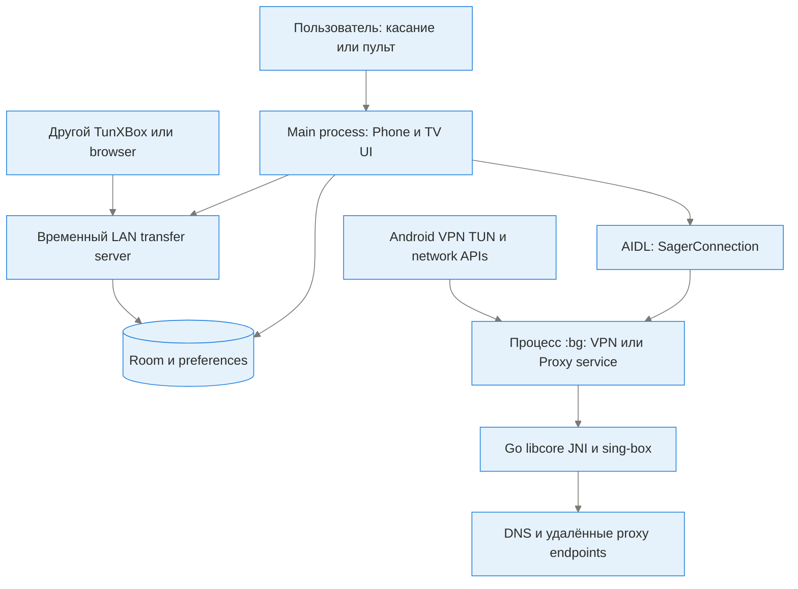
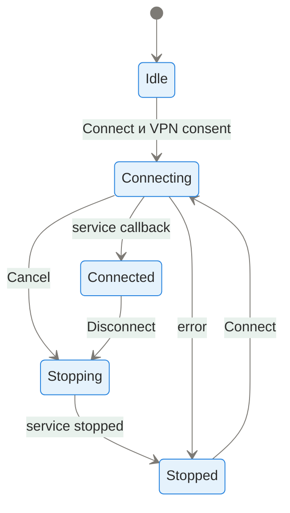

# Архитектура и потоки данных

Схемы используют идеи C4 и разделение control plane/data plane. Это объяснение фактического Android monolith + native core, не обещание Clean Architecture/MVVM во всех наследованных экранах.

## Контекст

Пользователь управляет двумя UI одного APK. Android предоставляет VPN consent/TUN, lifecycle, сеть, хранилище, camera/document picker. Сервис связывается с DNS/прокси/подпиской, выбранными пользователем. Другой телефон/TV общается по временному LAN HTTP. GitHub и upstream относятся к распространению/сборке, не участвуют как обязательное облако при каждом подключении.

## Контейнеры и процессы

| Подсистема | Ответственность | Источник |
|---|---|---|
| Bootstrap | Application, JNI init, themes, network monitor, notification channels | [SagerNet](../app/src/main/java/io/nekohasekai/sagernet/SagerNet.kt) |
| Launcher | Выбор интерфейса; обычный запуск отделён от deep-link imports | [ModeSelectionActivity](../app/src/main/java/io/nekohasekai/sagernet/ui/ModeSelectionActivity.kt), manifest |
| Phone UI | Navigation/menu, configuration/group/route/settings/tools/about | [ui](../app/src/main/java/io/nekohasekai/sagernet/ui) |
| TV UI | Leanback rows, stable IDs/diff/focus, tests/status, shared tool screens | [ui/tv](../app/src/main/java/io/nekohasekai/sagernet/ui/tv) |
| Profile domain | Bean formats, codec, config generation, parsers, plugins | [fmt](../app/src/main/java/io/nekohasekai/sagernet/fmt), [ConfigBuilder](../app/src/main/java/io/nekohasekai/sagernet/fmt/ConfigBuilder.kt), [moe extensions](../app/src/main/java/moe/matsuri/nb4a) |
| Persistence | Room DAOs/managers; selected/current/editing state and preference caches | [database](../app/src/main/java/io/nekohasekai/sagernet/database) |
| Service control | Bind/callbacks, foreground state, stop/reload, VPN/proxy entry | [bg](../app/src/main/java/io/nekohasekai/sagernet/bg), [AIDL](../app/src/main/aidl) |
| Native | Go mobile binding, sing-box, interface/DNS/platform bridge, HTTP, assets, STUN/ECH/procfs helpers | [libcore](../libcore), [NativeInterface](../app/src/main/java/moe/matsuri/nb4a/NativeInterface.kt) |
| Data plane | TUN sockets, core routing/DNS/outbounds and optional plugin processes | VpnService/BoxInstance/ProxyInstance, native dependencies |
| Transfer | Browser frontend, receive/export server, explicit scanner client, group codec | TvTransferServer/Client/GroupTransfer, [browser asset](../app/src/main/assets/tv-transfer.html) |
| App lifecycle | UI-only close/rebirth; separate full configuration restart | AppLifecycleActions; ProcessPhoenix `:phoenix`; Backup restore/settings paths |

## Подключение

Схема намеренно упрощена: [BaseService](../app/src/main/java/io/nekohasekai/sagernet/bg/BaseService.kt) и [TvInteractionPolicy](../app/src/main/java/io/nekohasekai/sagernet/ui/tv/TvInteractionPolicy.kt) — точные источники state/command guards. Busy/недоступный сервис — не Connected. Выбранный ID и ID текущего tunnel могут различаться.

- Control plane: UI → service command/IPC → callback/statistics → UI.
- Data plane: другие приложения → Android TUN/локальный proxy → core routes/DNS → сеть.
- Изменение UI/focus/профилей не должно само по себе сбрасывать VPN.
- Traffic tick обновляет Connection row, не перестраивает все TV adapters.
- Ticker/snapshot/subscription/test jobs ограничиваются lifecycle; callbacks проверяют существование view и актуальное состояние.

## Данные и хранение

| Данные | Форма и владелец | Особенности |
|---|---|---|
| Профили | ProxyEntity + protocol beans в Room | IDs локальны; credentials/config входят в payload; status/ping/traffic отдельно от bean |
| Группы | ProxyGroup; SubscriptionBean для subscription groups | Имя, порядок, selector/front/landing; membership через groupId |
| Rules | RuleEntity/Room | Отдельны от профилей; обычный outbound импорт не гарантирует их перенос |
| Global prefs | DataStore/configurationStore | service/DNS/routing/appearance/power; доступ между UI/:bg |
| Editor cache | profileCacheStore | Временные поля редактора, не место постоянного выбора режима |
| Выбор UI | TvUiPreferences в configurationStore | Миграция старого cached key; lastChoice влияет на picker focus |
| Assets | app assets + external/internal files | Generated GeoIP/GeoSite; пользовательские rule files; cache |
| Subscription update result (PR #5) | [Whitelist model/journal](../app/src/main/java/io/nekohasekai/sagernet/group/SubscriptionUpdateResult.kt), private SharedPreferences | Один completed result на группу, максимум 64; no URL/keys/raw logs, не tunnel health; не входит в текущие backup include lists |
| Backup | JSON + Android platform backup descriptors | Может включать ключи профилей/настройки; не публиковать без redaction |
| Signing | Только CI/private keystore + публичный certificate fingerprint | Не хранить private bundle в Room, APK или документации |

## Получение и передача

1. Browser QR хранит token во fragment; frontend передаёт его header в POST /import.
2. Native QR явно указывает `mode=import` либо `mode=export`; общий client выбирает POST/GET. Directionless QR получает прежний device-specific default.
3. Receive server экспорт запрещает. Send server импорт запрещает. GET выдаёт данные, но не доказывает, что получатель их импортировал.
4. Group codec передаёт полный набор typed beans, сохраняет имя/порядок/selector/front/landing; IDs chain references проверяются и переназначаются в одной Room transaction.
5. Приём создаёт **basic snapshot group**. Subscription URL и глобальные settings не клонируются этой операцией. Стандартный URL subscription импортируется отдельным updater workflow.
6. Cycles/внешние group dependencies/unknown types/oversize/invalid encoding — отказ до частичного сохранения. Полный backup остаётся отдельным способом переносить более широкий объём.

## Зависимости и расширения

17 manual editors строятся из одного menu XML и shared intent mapping. TV tools берут общий drawer catalog. Это снижает риск неполной второй реализации. Native core и plugin discovery расширяют protocol support; только presence файла/редактора не доказывает runtime capability на конкретном ABI.

[Весь набор параметров](reference/preferences.md) · [Файлы](reference/repository-index.md) · [Безопасность](security.md) · [Решения](decisions.md)
