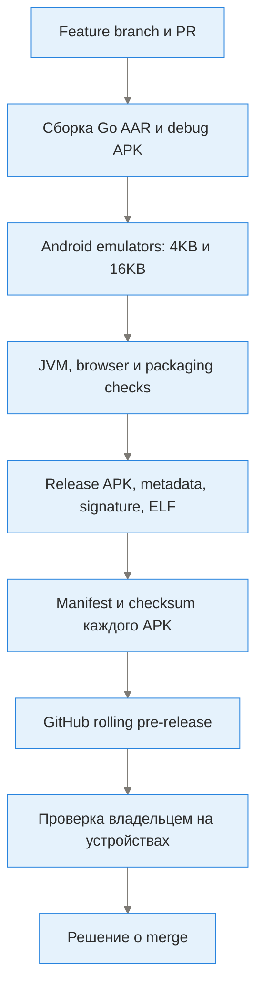

# Разработка, сборка, проверка и выпуск

## Карта жизненного цикла изменения

Граф показывает уровни gate, не точный порядок всех shell steps: authoritative workflow — [prerelease-from-pr.yml](../.github/workflows/prerelease-from-pr.yml). Ошибка gate блокирует publication; не использовать continue-on-error как замену исправлению.

## Состав сборки

| Слой | Текущие источники конфигурации |
|---|---|
| Android | SDK/target 35, min 21, build tools 35.0.1 — [Helpers](../buildSrc/src/main/kotlin/Helpers.kt) |
| JVM/Gradle | CI JDK 17; source/bytecode target Java 8; Gradle wrapper 8.10.2; Kotlin/KSP — build files |
| Native | NDK 25.0.8775105; CI Go 1.26.8; go.mod language/toolchain directives являются отдельными metadata, не отчётом о фактическом CI toolchain |
| Core source | MatsuriDayo forks sing-box/libneko, pinned commits из [get_source_env](../buildScript/lib/core/get_source_env.sh); replace в go.mod; sources загружаются рядом с repo, не являются содержимым tracked libcore tree |
| Assets | GeoIP/GeoSite latest releases из [assets.sh](../buildScript/lib/assets.sh); version markers пишутся в assets. Dynamic latest dataset ограничивает побитовую воспроизводимость одного source SHA |
| Flavors | oss/fdroid/play/preview; debug/release; наличие flavor не означает публикацию его в магазине |
| APK | ARM64, ARM32, universal; фактические ABIs читаются из APK, не угадываются по имени |
| Native 16KB | LOAD/RELRO flags на external linker; AAR/APK ELF и ZIP проверки; реальные x86_64 page-size smoke tests |

## CI и проверки

- [prerelease workflow](../.github/workflows/prerelease-from-pr.yml): управляемая PR-сборка и rolling RC. Android instrumentation выполняется до загрузки private signing bundle.
- [preview](../.github/workflows/preview.yml) и [release](../.github/workflows/release.yml): наследованные отдельные workflows; не считать их автоматически идентичными PR gate.
- [signing-backup](../.github/workflows/signing-backup.yml): отдельный зашифрованный backup signing material; encrypted artifact не APK.
- JVM: pure logic + Robolectric Android-shaped UI lifecycle. JNI Application startup заменён в соответствующих JVM tests.
- Browser: JS input classification, errors, receipt banner и duplicate-submit guards. Не полный browser-device end-to-end suite.
- Python: packaging, signing rules, assets, ELF/alignment metadata.
- Device: **debug instrumentation APK**, реальный Android 15 x86_64 4KB/16KB, настоящий core/Room/DPAD/UI/LAN. Не подписанный release APK, не физическая ARM-приставка и не throughput/failover/provider test.
- Release checks: actual applicationId/versionCode/target SDK, pinned signer, metadata, actual native alignment, uploaded bytes/filenames.

Числа тестов меняются: достоверные итоги — конкретный run/report, не устаревающая константа в документации. Test artifacts содержат screenshots/hierarchy/logcat для synthetic offline fixtures и ограничены retention. См. [emulator testing](emulator-testing.md).

## Обновление и распространение

Rolling tag `vVERSION-rc` не заменяет Android versionCode. VersionCode монотонно увеличивается; package и certificate сохраняются. [apk-manifest.json] в Assets фиксирует installedVersionName, versionCode, commit, ABI, size, SHA256 и signer. [SHA256SUMS.txt] проверяет байты скачивания, не malware safety и не авторство сам по себе.

Реальные имена Assets, URLs и HTTP Content-Disposition должны совпадать. Новые compatible RC устанавливаются поверх без uninstall; временный старый signer требует отдельной миграции/backup. Ключи и пароль backup передаются только через secure secret input, не в issue/commit/лог.

## Локальная работа

1. Проверить source ref, JDK/SDK/NDK/Go и зависимости; прочитать `run` и buildScript init.
2. Собрать/fetch core и assets: путь `app/libs/libcore.aar` generated/ignored; sources sing-box/libneko загружаются scripts.
3. Указать SDK в local.properties; не коммитить credentials.
4. `./gradlew app:testPreviewDebugUnitTest` — JVM; `node buildScript/test_tv_transfer_page.cjs` — browser logic.
5. `./gradlew app:assemblePreviewDebug app:assemblePreviewDebugAndroidTest` и `bash buildScript/run_emulator_smoke.sh 4096` на запущенном AVD; 16384 только на настоящем ps16k image.
6. Для production signing следовать [отдельной инструкции](signing-and-updates.md); не путать debug key с постоянным release identity.
7. Проверить документацию `python3 buildScript/check_project_docs.py`; обновить сценарии/реестр в этом же PR.

## Экосистема и зависимости

| Связь | Для чего | Граница |
|---|---|---|
| NekoBox/SagerNet/upstream main | Исходный UI/форматы/лицензии | TunXBox fork, не официальный upstream release |
| MatsuriDayo sing-box/libneko | Native networking и extensions | Pinned forks; язык Go/JNI; upstream API drift возможен |
| Android/AndroidX/Material/Leanback/Room | UI, lifecycle, storage, OS services | Разные API/OEM, optional camera/touch/TV features |
| ZXing/CameraX | QR scan/image | Нужна камера или image picker; receiving QR работает без TV camera |
| NanoHTTPD/browser | Временный LAN exchange | Не Internet cloud; HTTP не зашифрован |
| Plugin providers/executables | Дополнительные protocols/backends | Plugin compatibility зависит от установленных packages/ABI |
| GeoIP/GeoSite providers | Routing datasets | Отдельные network downloads/licenses/versions |
| GitHub Actions/Releases/Issues | CI, APK distribution, feedback | Runner — временный компьютер, не Android OS сам по себе |
| gh/Python/shell + contributor MCP tooling | Работа с repo/CI/secrets в разработке | MCP/Copilot/Notion не являются runtime dependency APK |
| VPN/подписочные providers пользователя | Реальные endpoints/URLs | TunXBox не выдаёт их credentials и не гарантирует доступность |

Полные прямые/транзитивные Go зависимости: [go.mod](../libcore/go.mod), [go.sum](../libcore/go.sum). Android зависимости: [app/build.gradle.kts](../app/build.gradle.kts), repositories/buildSrc. Licensing: [LICENSE](../LICENSE), [AUTHORS](../AUTHORS), core LICENSE; версии Third-party SDK проверяются из файлов, не из этого обзорного текста.
