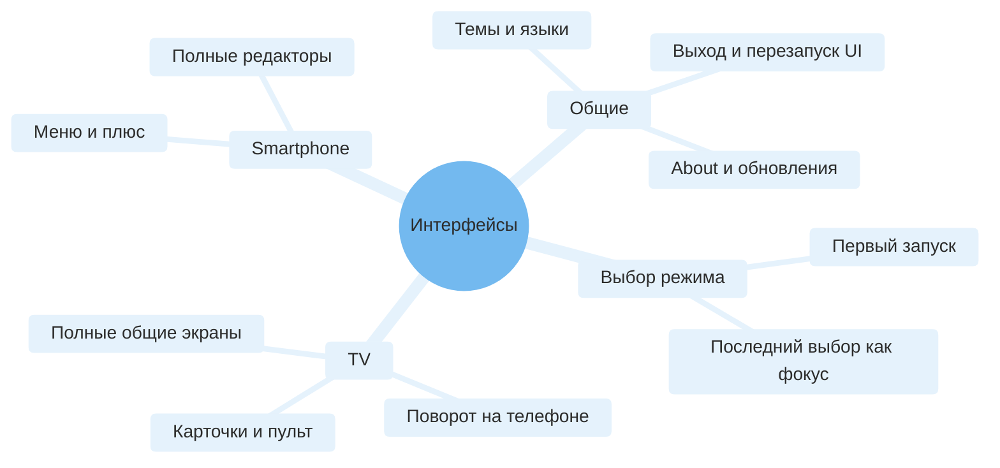
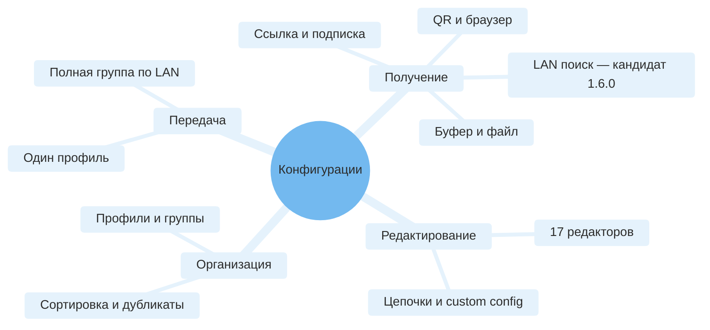

# Каталог функций

Идентификаторы F/S — стабильные ссылки для обсуждения требований, ошибок и тестов. Источники находятся в текущей ветке; URI подписок и ключи пользователей не нужны для понимания функций.

## Интерфейсы

| ID | Возможность | Реализация / ограничения |
|---|---|---|
| F01 | Launcher TunXBox, TV banner, TV/Phone picker | [ModeSelectionActivity](../app/src/main/java/io/nekohasekai/sagernet/ui/ModeSelectionActivity.kt), [manifest](../app/src/main/AndroidManifest.xml). Выбор перед загрузкой основного UI; deep links сохраняют свой обработчик. |
| F02 | TV: верхние действия, Connection, Profiles, Tools | [MainBrowseFragment](../app/src/main/java/io/nekohasekai/sagernet/ui/tv/MainBrowseFragment.kt), presenters и layout policy. Connect первым, Add постоянно, Smartphone последним. Выбранный и активный профиль различаются. |
| F03 | Пульт и доступность общих экранов | [RemoteRowActions](../app/src/main/java/io/nekohasekai/sagernet/ui/RemoteRowActions.kt), [RemoteFocusHighlighter](../app/src/main/java/io/nekohasekai/sagernet/ui/RemoteFocusHighlighter.kt). OK, DPAD, Menu/Info, Play/Pause, Back, видимые действия вместо обязательных swipe/drag. Не каждый редактор переписан в Leanback. |
| F04 | Smartphone, темы/языки, About, реклама, документация | [MainActivity](../app/src/main/java/io/nekohasekai/sagernet/ui/MainActivity.kt), [About](../app/src/main/java/io/nekohasekai/sagernet/ui/AboutFragment.kt), [Promotions](../app/src/main/java/io/nekohasekai/sagernet/ui/PromotionsFragment.kt), [menu](../app/src/main/res/menu/main_drawer_menu.xml). Dashboard/реклама имеют условную доступность; upstream attribution отделён от TunXBox. |

## Профили и группы

| ID | Возможность | Реализация / ограничения |
|---|---|---|
| F05 | CRUD, выбор, детали, QR/share, порядок профилей | [ConfigurationFragment](../app/src/main/java/io/nekohasekai/sagernet/ui/ConfigurationFragment.kt), [ProfileManager](../app/src/main/java/io/nekohasekai/sagernet/database/ProfileManager.kt), TV profile actions. Изменение активного профиля требует безопасного состояния сервиса. |
| F06 | Все ручные редакторы из Phone + доступны TV | [ProfileCreationActions](../app/src/main/java/io/nekohasekai/sagernet/ui/ProfileCreationActions.kt), [menu](../app/src/main/res/menu/add_profile_menu.xml). SOCKS, HTTP(S), Shadowsocks, VMess, VLESS, Trojan, Trojan-Go, Mieru, Naïve, Hysteria, TUIC, ShadowTLS, AnyTLS, SSH, WireGuard, custom config, chain. Наличие редактора не гарантирует работу без нужного плагина. |
| F07 | Импорт стандартных ссылок, JSON/YAML, sing-box outbound, файлов/буфера/QR | [RawUpdater](../app/src/main/java/io/nekohasekai/sagernet/group/RawUpdater.kt), [TvProfileImporter](../app/src/main/java/io/nekohasekai/sagernet/ui/tv/TvProfileImporter.kt), fmt packages. Это импорт профилей/outbounds, не гарантированный перенос всех правил и настроек стороннего приложения. |
| F08 | Группы и подписки, обновление и metadata | [GroupFragment](../app/src/main/java/io/nekohasekai/sagernet/ui/GroupFragment.kt), [GroupUpdater](../app/src/main/java/io/nekohasekai/sagernet/group/GroupUpdater.kt), [SubscriptionUpdater](../app/src/main/java/io/nekohasekai/sagernet/bg/SubscriptionUpdater.kt). HTTP(S), sn/clash wrappers; доступ к URL требуется принимающему устройству. |
| F09 | Цепочки, selector group, front/landing proxy | [ProxyGroup](../app/src/main/java/io/nekohasekai/sagernet/database/ProxyGroup.kt), [ConfigBuilder](../app/src/main/java/io/nekohasekai/sagernet/fmt/ConfigBuilder.kt), ChainSettings. Связи используют локальные DB IDs. Остаточные XML balancer resources сами по себе не доказывают доступную автоматическую балансировку. |
| F10 | Явные QR receive/send; копия целой группы | [TvTransferServer](../app/src/main/java/io/nekohasekai/sagernet/ui/tv/TvTransferServer.kt), [TvTransferClient](../app/src/main/java/io/nekohasekai/sagernet/ui/tv/TvTransferClient.kt), [TvGroupTransfer](../app/src/main/java/io/nekohasekai/sagernet/ui/tv/TvGroupTransfer.kt). Группа не сводится к одному выбранному профилю. Копируются beans/порядок/внутренние ссылки, а не глобальные настройки или подписка. |

| F19 | Ручной LAN-поиск: кандидат 1.6.0, не stable 1.5.0 | [Scope/архитектура/приёмка](lan-discovery.md). Shared TV/Phone; opt-in, физическая сеть, protocol evidence, cancel/deadline, ручной save/dedupe. Не Internet-health test и не auto-connect. |

### Форматы и протоколы

Протоколы отличаются от способов доставки: VLESS/SSH — форматы профиля; LAN/файл/QR — перенос. Ключи, TLS, transport, multiplexing и другие поля зависят от редактора. Полный список XML-полей с источниками находится в [справочнике](reference/preferences.md). `fmt/TypeMap.kt` содержит aliases отдельных universal links; внутренний групповой codec отдельно учитывает chain и ShadowTLS, поэтому отсутствие alias не означает пропуск профиля.

## Подключение и диагностика

| ID | Возможность | Реализация / ограничения |
|---|---|---|
| F11 | VPN и локальный proxy, consent, foreground service, tile/shortcuts, boot/power policies | [VpnService](../app/src/main/java/io/nekohasekai/sagernet/bg/VpnService.kt), [ProxyService](../app/src/main/java/io/nekohasekai/sagernet/bg/ProxyService.kt), [BaseService](../app/src/main/java/io/nekohasekai/sagernet/bg/BaseService.kt), [manifest](../app/src/main/AndroidManifest.xml). ОС может ограничивать фоновые процессы; consent — системный диалог. |
| F12 | Статус, активный профиль, скорости/счётчики | [TrafficLooper](../app/src/main/java/io/nekohasekai/sagernet/bg/proto/TrafficLooper.kt), [TrafficUpdater](../app/src/main/java/io/nekohasekai/sagernet/bg/proto/TrafficUpdater.kt), AIDL/Connection row/StatsBar. Нулевой трафик при простое нормален; Connected не гарантирует доступ в Интернет. |
| F13 | TCP/URL проверки группы, отмена, результаты, сортировка; active-tunnel URL test | [TvDiagnostics](../app/src/main/java/io/nekohasekai/sagernet/ui/tv/TvDiagnostics.kt), [TestInstance](../app/src/main/java/io/nekohasekai/sagernet/bg/proto/TestInstance.kt), [UrlTest](../app/src/main/java/io/nekohasekai/sagernet/bg/proto/UrlTest.kt). URL test зависит от тестового URL; TCP port connect не равен ICMP ping или исправному VPN. |
| F14 | Logs, Clash-compatible dashboard, STUN; Home/YouTube | [LogcatFragment](../app/src/main/java/io/nekohasekai/sagernet/ui/LogcatFragment.kt), [WebviewFragment](../app/src/main/java/io/nekohasekai/sagernet/ui/WebviewFragment.kt), [StunActivity](../app/src/main/java/io/nekohasekai/sagernet/ui/StunActivity.kt). YouTube может отсутствовать. Home/YouTube и закрытие UI не отправляют VPN stop. |

## Настройки и инструменты

| ID | Возможность | Реализация / ограничения |
|---|---|---|
| F15 | Правила маршрутизации, DNS/IPv6, per-app routing | [RouteFragment](../app/src/main/java/io/nekohasekai/sagernet/ui/RouteFragment.kt), [RouteSettings](../app/src/main/java/io/nekohasekai/sagernet/ui/RouteSettingsActivity.kt), [AppListActivity](../app/src/main/java/io/nekohasekai/sagernet/ui/AppListActivity.kt), ConfigBuilder. |
| F16 | TUN/MTU, mixed port/LAN access, sniffing, TLS и custom config | [global_preferences](../app/src/main/res/xml/global_preferences.xml), [DataStore](../app/src/main/java/io/nekohasekai/sagernet/database/DataStore.kt), [native configuration](../app/src/main/java/moe/matsuri/nb4a/SingBoxOptions.java). Некоторые overrides меняют гарантии безопасности. |
| F17 | GeoIP/GeoSite/custom assets, backup/restore | [AssetsActivity](../app/src/main/java/io/nekohasekai/sagernet/ui/AssetsActivity.kt), [BackupFragment](../app/src/main/java/io/nekohasekai/sagernet/ui/BackupFragment.kt), [asset build](../buildScript/lib/assets.sh). Backup — отдельная операция и может содержать секреты; полный restore может перезапускать VPN. |
| F18 | Проверка TunXBox updates, установка поверх, выход/перезапуск UI | [ReleaseUpdatePolicy](../app/src/main/java/io/nekohasekai/sagernet/ui/ReleaseUpdatePolicy.kt), [AppLifecycleActions](../app/src/main/java/io/nekohasekai/sagernet/ui/AppLifecycleActions.kt), signing docs. Сравниваются package/certificate/versionCode; для старых временных ключей возможна однократная миграция. |

Порядок дальнейшей разработки и критерии принятия — [roadmap](roadmap.md).

## Не считать реализованным

- Новый непрерывный UI health monitor и автоматический переход на живой профиль — отдельный будущий объём. Native selector/custom core config не равны проверенному end-to-end failover сценариям TunXBox.
- Специальная миграция Happ/Incy — не заявлена. Стандартный экспорт может подойти общему parser, но это нужно проверять на образцах.
- Облачная синхронизация, учётная запись TunXBox, выдача VPN-подписок — не входят в приложение.
- Физическая плавность анимации, каждый OEM/пульт/ABI/Android API, реальные VPN-провайдеры и throughput не сертифицированы набором smoke tests.
