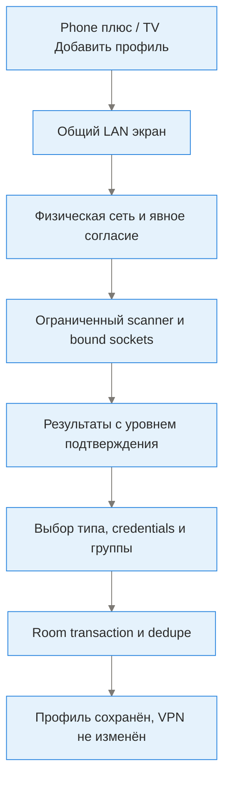

# Ручной поиск прокси в локальной сети

## Статус и границы

Новая реализация находится в отдельной `feature/lan-proxy-discovery-v2`, основанной на `master` после стабильной 1.5.0. Не входит в immutable APK 1.5.0. До успешного CI и ручной приёмки владельцем это кандидат следующего выпуска **1.6.0**, не готовая стабильная функция. Старые discovery-ветки сохранены; их службы/ошибочные импорты не копировались.

Поиск обнаруживает **локальные TCP listeners и ответы протокола**, не проверяет весь VPN-туннель, доступность интернета, скорость или исправность провайдера. Нет фонового автопоиска, автосохранения, автоподключения или failover. Эти сценарии требуют отдельных PR.

## Пользовательский сценарий

1. Подключить устройства к доверенной Wi-Fi/Ethernet сети. Получить разрешение владельца сети на проверку серверов.
2. Открыть «Поиск прокси в локальной сети»: Phone `+`/боковое меню либо TV «Добавить профиль»/«Все функции». Экран одинаковый для обоих режимов.
3. Проверить IPv4 устройства и область сканирования; при нескольких сетях выбрать нужную. Указать до восьми разных портов (по умолчанию 1080, 8080, 8118, 7890).
4. Подтвердить область и нажать «Начать поиск вручную». Открытие экрана само по себе ничего не сканирует.
5. При необходимости отменить. Уход с экрана/поворот или смена сети отменяет поиск, очищает результаты и требует нового подтверждения.
6. Выбрать результат, проверить тип и при необходимости ввести логин/пароль. Выбрать **локальную BASIC-группу**, не подписку, и явно сохранить.
7. Профиль записывается транзакционно. Повторный endpoint/протокол/учётные данные в той же группе не создают дубликат. Название не является идентификатором дубликата.
8. Сохранение **не меняет выбранный/активный профиль и не подключает VPN**. Использовать отдельные тесты профиля/группы и подключиться вручную.

## Политика сети и ресурсы

- Только числовые RFC1918 IPv4 в текущей физической Wi-Fi/Ethernet сети. Без DNS, cellular, VPN, public IP, link-local, IPv6-only или default-route fallback.
- Socket привязан через `Network.socketFactory` к выбранной физической Android Network; активный VPN не является сетью для поиска.
- Фактический prefix /24…/30 сохраняется. Более широкая сеть ограничивается /24-сегментом IP устройства. /31 и /32 не имеют подходящих соседей. Исключены network/broadcast, все IP устройства и gateways.
- Максимум 254 адреса, 8 уникальных портов, 8 одновременных probes, 45 секунд и 64 результата. Connect timeout 250 мс, read timeout 700 мс; отмена закрывает блокирующие сокеты.
- Отсутствие результата не доказывает отсутствие прокси: client isolation, firewall, нестандартный порт, IPv6, медленный ответ или неподдерживаемый протокол могут помешать.
- Credentials не отправляются при поиске, не попадают в diagnostic messages. При явном сохранении хранятся в существующей локальной базе профилей; это не новая схема шифрования секретов.

## Значение результатов

| Ответ | Что известно | Что не доказано |
|---|---|---|
| SOCKS5 `[05 00]` | Listener выбрал SOCKS5 без авторизации | Поддержка нужных команд, forwarding, интернет |
| SOCKS5 `[05 02]` | Listener запросил username/password | Правильность введённых credentials и интернет |
| HTTP 407 | Ответ proxy-authentication-required | Credentials, forwarding и интернет |
| Другой корректный HTTP status, включая 200 | HTTP listener; прокси не подтверждён | Это может быть обычный веб-сервер |
| Открытый TCP без корректного handshake | Listener существует; протокол неизвестен | Нельзя определять тип по номеру порта |

Для HTTP отправляется `CONNECT 127.0.0.1:0`: заведомо некорректный локальный порт без внешнего адреса, DNS, credentials и tunnel payload. Никакой HTTP 200 не объявляется автоматически рабочим прокси. Неподтверждённые результаты требуют ручного выбора SOCKS5/HTTP и последующего тестирования.

## Архитектура

- [LanScope](../app/src/main/java/io/nekohasekai/sagernet/ui/lan/LanScope.kt): pure policy, numeric IPv4/CIDR/ports.
- [LanEnvironment](../app/src/main/java/io/nekohasekai/sagernet/ui/lan/LanEnvironment.kt): physical Android networks и fingerprint для отмены при смене.
- [ProxyProbe/LanScanner](../app/src/main/java/io/nekohasekai/sagernet/ui/lan/ProxyProbe.kt): протокольные ответы, concurrency/deadline/cancellation/partial results.
- [LanDiscoveryFragment](../app/src/main/java/io/nekohasekai/sagernet/ui/lan/LanDiscoveryFragment.kt): shared opt-in UI, результат/подтверждение, lifecycle cancellation.
- [LanProfileStore](../app/src/main/java/io/nekohasekai/sagernet/ui/lan/LanProfileStore.kt): existing HttpBean/SOCKSBean, Room transaction, уведомление только после commit.
- [JVM fixtures](../app/src/test/java/io/nekohasekai/sagernet/ui/lan/LanDiscoveryTest.kt), [Robolectric integration](../app/src/test/java/io/nekohasekai/sagernet/ui/LaunchRegressionTest.kt), [Android smoke](../app/src/androidTest/java/io/nekohasekai/sagernet/ui/EmulatorSmokeTest.kt).

## Приёмка перед merge

- [ ] Полный CI: JVM/Room/UI, browser, packaging/signature/alignment и **10/10** Android checks на каждой 4KB/16KB AVD.
- [ ] Actual portrait/landscape LAN screenshots inspected; никакие HTML mocks не считаются screenshot APK.
- [ ] RC устанавливается поверх stable 1.5.0 без потери групп; pinned signer/package, versionCode base 48.
- [ ] На своей сети с разрешением проверить известный SOCKS5, HTTP с auth, обычный HTTP server и закрытый порт. Подтвердить truthful labels, auth/group/save/dedupe и отсутствие автоподключения.
- [ ] Пульт: открыть через TV Add, пройти scope/consent/ports/scan/cancel/result/group/save; фокус виден, нет недоступного действия.
- [ ] Во время scan сменить Wi-Fi/открыть Home/повернуть телефон. Поиск не продолжается в фоне, результаты очищаются; повтор требует согласия.
- [ ] Проверить, что QR receive/export, импорт группы и существующий active VPN не регрессировали.

Галочки ставить по фактическим evidence/приёмке, не по наличию тестового файла. Physical ARM/OEM/provider checks не заменяются x86_64 smoke.
