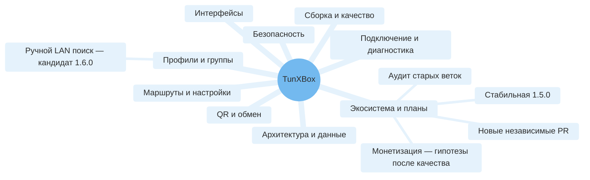

# Полная карта проекта TunXBox

## Границы и статус

TunXBox — Android-клиент на базе NekoBox/SagerNet и форка sing-box, а не поставщик VPN-подписки, облачный синхронизатор или официальная сборка upstream. Код UI сохраняет namespace `io.nekohasekai.sagernet`, установленный пакет — `com.tunxbox.app`.

Это карта принятого baseline и текущей отдельной feature-ветки. Ручной LAN-поиск пока кандидат 1.6.0 и не входит в стабильную 1.5.0; [границы и приёмка](lan-discovery.md). «Есть в коде» не означает «проверено на всех устройствах». Динамическая доступность зависит от API Android, режима, группы, состояния сервиса и установленных плагинов. Неиспользуемые наследованные ресурсы тоже входят в [реестр](reference/repository-index.md), но не объявляются доступными функциями.

## Все ветви карты

| Ветвь | Содержимое | Детали |
|---|---|---|
| Интерфейсы | Выбор TV/Phone, Leanback, Material, пульт/касание, темы, локализации, About, локальный раздел рекламы | [Функции F01–F04](features.md#интерфейсы), [сценарии S01–S03](scenarios.md) |
| Профили | 17 ручных редакторов; импорт, CRUD, выбор, активный профиль, QR, файл/буфер, цепочки и custom config | [Каталог](features.md#профили-и-группы), [XML-параметры](reference/preferences.md) |
| Группы | Обычные/подписки, обновления, сортировка, дубликаты, тесты, selectors/front/landing, полная локальная копия группы | [F05–F10](features.md#профили-и-группы), [сценарии](scenarios.md) |
| Подключение | VPN/локальный proxy, согласие Android, :bg foreground service, старт/стоп, tile/shortcuts, уведомления | [Архитектура](architecture.md), [S08–S11](scenarios.md) |
| Ручной LAN-поиск | Физическая RFC1918 сеть, opt-in, ограниченный scan, protocol evidence, ручной выбор/сохранение; не auto-connect/failover | [F19 / приёмка](lan-discovery.md) |
| Диагностика | Трафик, активный tunnel URL test, TCP/URL тесты группы, история результатов, логи, STUN, dashboard | [F11–F14](features.md#подключение-и-диагностика) |
| Маршруты/настройки | Правила, per-app routing, DNS/IPv6/sniffing, TUN/MTU, TLS, mixed port, assets, power/network policies | [F15–F18](features.md#настройки-и-инструменты), [справочник](reference/preferences.md) |
| QR/обмен | Явные receive/export/scanner направления; браузер без установки; индивидуальный QR и группа по LAN; токены/лимиты | [Руководство](tv-transfer.md), [границы доверия](security.md) |
| Данные | Room, configuration/profile cache, Android backup и ручной backup, журналы, assets, ключи профилей | [Модель данных](architecture.md#данные-и-хранение) |
| Сборка/качество | Gradle/Kotlin/KSP, Go/JNI/AAR, APK ABI, release signing, CI, JVM/Robolectric/browser/Python/device тесты | [Разработка](development.md), [эмуляторы](emulator-testing.md) |
| Экосистема | Upstream GPL, forks ядра, GeoIP/GeoSite, Android APIs, плагины, GitHub Releases/Actions/Issues, инструменты разработки | [Внешние зависимости](development.md#экосистема-и-зависимости) |
| Roadmap | Stable first; аудит старых веток; discovery/TV fixes/failover отдельными PR | [Этапы и критерии](roadmap.md), [аудит веток](branch-audit.md) |
| Будущее | Прямой Happ/Incy импорт; новый непрерывный health/failover; расширение реальных-device проверок | [Честные границы](features.md#не-считать-реализованным) |
| Каждый файл | Исходники, AIDL, XML, ресурсы/языки, изображения, тесты, скрипты, workflow, лицензии, metadata | [Полный реестр](reference/repository-index.md) |

## Навигация по слоям

1. **Пользователь:** [функции](features.md) → [сценарии](scenarios.md).
2. **Разработчик:** [архитектура](architecture.md) → [реестр](reference/repository-index.md) → код.
3. **Сборка/приёмка:** [development](development.md) → [emulator tests](emulator-testing.md) → [readiness](tv-readiness-plan.md).
4. **Риски:** [security](security.md) → [signing](signing-and-updates.md) → [decisions](decisions.md).

Ни mind map, ни число тестов не являются разрешением автоматически слить PR. Приёмка владельца на телефоне и приставке остаётся отдельным этапом.

## Новая ветвь развития: Happ и диагностируемая совместимость

Планы в ветвях «Подключение и диагностика», «Профили и группы», «Архитектура и данные», «Сборка и качество» и «Безопасность»: [матрица протоколов/транспортов/ядер, диагностические этапы, безопасные отчёты и pinned core updates](protocol-compatibility.md). Приоритет Happ; остальные клиенты требуют отдельного подтверждения. XHTTP не объявлять поддержанным по одному успешному импорту. Статус: отдельный draft PR #5; fail-closed guard, первые диалоги, atomic apply и local result в коде; checkpoint 6691f76b прошёл полный CI, дополнительные экранные проверки и ручная приёмка ещё требуются. Полная совместимость и tunnel diagnostic pipeline не реализованы.

## Согласованная доработка ТВ-layout

[Roadmap R9](roadmap.md): сохранить Leanback/native UI, выделить подключение, компактный статус, понятный выбор группы/профилей и второстепенные инструменты; стабильный D-pad фокус и adaptive portrait/landscape. Это отдельный будущий UI PR, не выполненный redesign и не повод форкать приложение ради layout. Диагностика и совместимость остаются текущим приоритетом.

## Безопасная локальная диагностика и монетизация

PR #5: [этапы/сохранённый результат/ручная сводка](protocol-compatibility.md); не смешивать с готовностью health/failover. [Модели монетизации](monetization.md) — гипотезы после качества, без платёжного runtime/backend/paywall.

[Безопасная обратная связь](diagnostic-support.md): шаги воспроизведения, значение фиксированных кодов, whitelist report и запрет публикации секретов/raw logs без проверки. Issue templates EN/RU/ZH больше не предлагают открыто прикладывать реальные подписочные ссылки.
