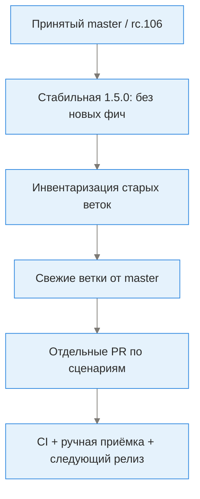

# Roadmap TunXBox

## Решение и исходная точка

План согласован владельцем: сначала стабильная **1.5.0** из принятого `master`, затем отдельные новые PR. PR #1 принят squash merge (`b1481137`); rc.106 прошла CI и ручную проверку владельца. Это не подтверждение будущих функций. `main` (`5768494d`) остаётся рабочим upstream; её не переписывать. Сроки не обещаются до оценки работ.

## Карта последовательности

Текстовый эквивалент: принятый baseline → стабильный выпуск → аудит старых наработок → новые ветки → независимые PR → проверка и следующий выпуск. Draft PR можно открывать параллельно; новые функции не блокируют 1.5.0. Критическая ошибка baseline блокирует выпуск.

## Этапы и критерии завершения

| ID | Этап | Статус | Граница / Definition of Done |
|---|---|---|---|
| R0 | Принять TV/Phone, QR/LAN, документацию | Завершён | PR #1 merged; пользователь проверил rc.106; CI успешен |
| R1 | Выпустить стабильную 1.5.0 | Завершён: [v1.5.0](https://github.com/LeonidYasin/TunXBox/releases/tag/v1.5.0), [CI](https://github.com/LeonidYasin/TunXBox/actions/runs/37516999482) | Source из master; versionName без rc; постоянный signer/package; versionCode > rc.106; все проверки; три реальных APK; публичный immutable v1.5.0; release notes/manifest/SHA256; установка поверх RC |
| R2 | Аудит старых веток | Первичный статический аудит выполнен; [находки и следующий scope](branch-audit.md) | Сохранить refs; сравнить реальные trees с master; составить список unique/duplicate/obsolete; не считать ahead_by числом новых функций после squash |
| R3 | Поиск прокси в LAN | Реализация в отдельной feature/lan-proxy-discovery-v2; CI/приёмка ещё не завершены, [scope](lan-discovery.md) | Оценить обе discovery ветки вместе; один согласованный design; явный opt-in/область сканирования/timeout/cancel; безопасное хранение; TV/Phone; unit/device/network fixtures |
| R4 | Актуальные TV исправления | Условно | Взять только ещё воспроизводимые проблемы; не заменять новый UI старой реализацией; при отсутствии unique fixes закрыть направление как redundant |
| R5 | Живость туннеля и failover | План, отдельный PR | End-to-end check, не просто TCP/Connected; несколько неуспехов, cooldown/hysteresis, отмена, подходящая группа/ручной override, без reconnect loop; tests Wi-Fi change/background/all-down/recovery |
| R6 | Совместимость Happ/Incy | Исследование | Пользовательские обезличенные samples/официальные export formats; не обещать чтение sandbox чужого приложения; использовать общий import где возможно |
| R8 | Диагностика и совместимость, Happ first | Новый приоритет до R5, [план](protocol-compatibility.md) | Явные ошибки/безопасные отчёты; lossless import; protocol/transport/core matrix; Xray assessment; pinned sing-box updates с CI/приёмкой; не обещать all-protocol parity без evidence |
| R7 | Расширение тестов | Постоянно | Физические ARM/OEM/пульт/поворот; APK release smoke; real provider только с явной безопасной fixture; emulator smoke не выдавать за throughput/VPN сертификацию |
| R10 | Обновление приложения без браузера: stable / test | Согласованный план, отдельный PR; не реализовано | Проверка канала, подходящий APK, проверка signer/package/hash/versionCode, скачивание с прогрессом и стандартный установщик Android; TV/Phone и приёмка обновления с сохранением данных |

Номера будущих релизов предварительные: исправления — patch (например 1.5.1), существенные новые функции — minor (например 1.6.0). Следующий Android VERSION_CODE base необходимо увеличить после stable, чтобы следующий RC устанавливался поверх stable.

## R9 — визуальная иерархия ТВ-layout (согласованный план)

Сохранить native TunXBox и Leanback; ради расположения кнопок не мигрировать на Flutter и не менять base project на VPN4TV. Полезную простоту главного экрана VPN4TV использовать как reference, не как доказательство лучшей навигации. Изменения отдельным UI PR после текущих приоритетных diagnostics/compatibility задач; runtime layout пока не изменён.

- Подключение/отключение/отмена — главный визуальный акцент и начальный фокус. Не перехватывать фокус обратно при каждом обновлении трафика. Сохранять текущий верхний порядок: подключение → группа → добавить профиль → режим смартфона.
- Компактный блок соединения: активный профиль, результат проверки доступа и время проверки, текущие скорости. «Сервис запущен» не равно «интернет проверен». Подробные счётчики/ошибки открываются явным действием; важная ошибка остаётся заметной, не только toast.
- Группа и профили — следующий уровень. Выбранный и реально подключённый профиль различимы без цвета; после обновления/удаления группы фокус остаётся предсказуемым.
- Редкие операции собрать в «Инструменты»/«Ещё»: обновление/экспорт/тесты/настройки/перезапуск/закрытие. Ничего не удалить: полный каталог Phone/TV, все варианты добавления, QR receive/send и полная группа сохраняются. Частые действия не прятать без проверки сценариев.
- Кнопки с понятными текстовыми подписями, отчётливым focus state, достаточным контрастом и TV-readable текстом; не заменять меню набором маленьких иконок.
- Адаптивная высота и безопасные отступы: TV 720p/1080p, крупный системный шрифт, phone TV-mode portrait/landscape, отсутствие наложений/дёрганой прокрутки.

Acceptance: actual Android screenshots + D-pad/device smoke; холодный старт/Back/возврат/rotation/DB+traffic updates не сбивают фокус; подключение, выбор группы/профиля, импорт, проверка и выход доступны без focus trap; пустая группа/длинные имена/ошибка/отключение покрыты. Сравнивать по понятности и числу действий в одинаковых сценариях, не по «уникальности» дизайна. Owner review до merge; не менять immutable stable и не объявлять redesign выполненным по одному макету.

## Сохранённые наработки

| Ветка | HEAD при инвентаризации | Действие |
|---|---|---|
| feature/proxy-discovery | 8e20a35e | Сравнить и объединить полезные идеи с auto variant; не мержить подряд обе |
| feature/auto-proxy-discovery | 4e602b76 | Проверить overlap и автоматическое сканирование/фоновые permissions |
| fix/tv-ui-rendering | c5c504cf | Аудит против нового master; часть TV/QR уже реализована иначе |
| feature/tv-remote-support | 1b954a53 | История принятой rc.106; после squash не использовать как следующий PR baseline |

Старые refs не удалять/force-push до подтверждения полного переноса. Из свежей master-ветки переносить небольшие уникальные изменения (selective cherry-pick либо адаптация к новой архитектуре), а не весь старый stack. Для совместной старой ветки merge master предпочтительнее переписывания общей истории, но здесь рекомендован чистый новый baseline. Один PR — одна связная пользовательская задача, отдельная проверка и откат. Имена новых веток уточнить при открытии; не объединять всё в один mega-PR.

## Правила выпуска

- Стабильный tag immutable: не force-update и не подменять APK ранее опубликованной версии.
- Pre-release tag остаётся отдельным; не снимать pre-release badge с APK, внутри которого versionName rc.
- Stable **ossRelease** использует те же TV/Phone источники, но не preview suffix. VersionCode = VERSION_CODE base × 1 000 000 + 999 999; для текущего base 47 это 47 999 999, выше rc.106 (47 000 106).
- После stable base 47 следующие RC должны иметь base минимум 48; plain name 1.5.1 сам по себе не гарантирует upgrade ordering.
- Pipeline [stable-release.yml](../.github/workflows/stable-release.yml) сначала проверяется в release PR без публикации. Публикация разрешена только из master, с заранее созданным immutable tag на точный SHA и pinned signer; private signing bundle только после device checks.
- Подробности: [разработка](development.md), [подпись](signing-and-updates.md), [функции](features.md), [приёмка](tv-readiness-plan.md).

## Инструменты разработки / MCP backlog

Это независимые issues в mcp-server, не runtime функции APK. Проверка проведена по фактическим сбоям и коду; production server здесь не изменяется.

| Issue | Улучшение |
|---|---|
| [#60](https://github.com/LeonidYasin/mcp-server/issues/60) | Сохранять file executable/symlink modes в batch push |
| [#61](https://github.com/LeonidYasin/mcp-server/issues/61) | Честный общий status/check runs, no_checks vs pending |
| [#62](https://github.com/LeonidYasin/mcp-server/issues/62) | Merge с expected SHA и структурированным preflight |
| [#63](https://github.com/LeonidYasin/mcp-server/issues/63) | Реальное безопасное разрешение artifact download redirect |
| [#64](https://github.com/LeonidYasin/mcp-server/issues/64) | Atomic update_tag и управление existing releases |
| [#65](https://github.com/LeonidYasin/mcp-server/issues/65) | Уважать max_files и ограничения ответа compare |
| [#66](https://github.com/LeonidYasin/mcp-server/issues/66) | Repository Actions secrets: metadata/encrypted writes, без раскрытия values |

## Факт выпуска 1.5.0

Опубликована из immutable source `7e230f24`; versionName **1.5.0**, versionCode **47 999 999**. Сертификат и package совпадают с rc.106. Финальный полный CI: 125 JVM, 15 browser, 31 Python (без повторного подсчёта packaging), 8/8 OSS Android 4KB и 8/8 OSS Android 16KB. Все три публичных APK независимо скачаны и проверены по SHA256/size/ABI/Content-Disposition. Первый publication attempt блокировал системный ANR Pixel Launcher; повтор на чистом runner прошёл без изменения source или отключения checks. Это не сертификат каждого физического OEM/provider. Stable APK ещё требует обычной пользовательской эксплуатации; ручная приёмка rc.106 не выдаётся за отдельное физическое тестирование stable flavor.

Результаты статического аудита не разрешают автоматически переносить/мержить старые ветки. Discovery implementation и failover остаются планами.

## Обновление плана

В каждом PR менять статус только после фактического результата; добавлять ссылки на PR/run/release и acceptance evidence. «В подготовке», «merged», «опубликован» и «проверен на устройстве» — разные состояния. Карта [project-map](project-map.md) показывает roadmap как планы, не как реализованные функции.

### Уточнение LAN-поиска после rc.114

PR #4: общий Phone/TV экран; шлюзы и адреса устройства включены, все порты шлюза проверяются первыми. Несколько IPv4 объединяются в ограниченные диапазоны; точные диапазоны/адреса/число целей показываются до согласия. Ethernet доступен без Wi-Fi; выбор сети больше не выглядит неработающим при одной/нуле подходящих сетей. Порты 10808, 10809 и текущий mixedPort. Явная навигация пультом до редактора портов и обратно, OK для клавиатуры. Требуются CI 4KB/16KB, Robolectric и ручная проверка пульта на приставке перед merge. Это не исправление провайдерских TLS/REALITY/XHTTP проблем из отдельного PR #5.

## Приоритет после новых находок владельца

Ошибки подписки/TLS/REALITY и неизвестный XHTTP фиксируются в [отдельном направлении](protocol-compatibility.md). Диагностика и подтверждённая совместимость важнее автоматического failover. LAN PR #4 остаётся отдельным scope; новые изменения создаются от актуального master и не подменяют immutable 1.5.0. Это план работ, не объявление готового исправления.

## Обязательный приоритет: подписки и диагностика подключения

До следующего стабильного релиза довести импорт/обновление подписок и объяснение отсутствия трафика по критериям [S1–S3](protocol-compatibility.md). Порядок: сохранность группы и честный результат импорта → этапы/история ошибок → проверка handshake/DNS/HTTPS через туннель → безопасный отчёт → совместимость конкретных пользовательских протоколов. Авто-failover, удалённый бот и редизайн не заменяют это качество. В PR #5 первый диалог уже реализован, но остальной scope ещё не готов; не считать LAN CI подтверждением диагностики. Нельзя обещать «до предела отлажено» без fixtures, native integration и ручной проверки владельца.

### Следующая проверяемая итерация D1/S1

Локальный last-attempt результат по этапам, separate last-success metadata, Phone/TV повторное открытие диагностики и ручной whitelist report; atomic profile/group apply и stale-request guard. Код в PR #5; checkpoint 6691f76b прошёл полный check-only CI, дополнительный Android screen scenario ещё проверяется. Не входит в опубликованную rc.115. Остальные S1–S3/network/core пункты остаются открытыми. JVM checks до эмуляторов — не отмена Android gates.

### Монетизация после качества

[Модели и ограничения](monetization.md): открытый бесплатный клиент, добровольная поддержка/услуги настройки/B2B; optional cloud после проверки спроса и безопасной архитектуры. Цены/каналы не утверждены; не добавлять платёжный SDK, рекламу, обязательный аккаунт или paywall диагностики в текущие PR.

Обратная связь: [руководство](diagnostic-support.md) и безопасные EN/RU/ZH issue templates. Никаких private provider URLs/raw configs в публичном issue; полный raw-log sanitizer ещё не реализован.

## Проверочная интеграция 1.6.0 (без merge)

По запросу владельца отдельная ветка `feature/integration-1.6-review` объединяет PR #4 source 5f3a5ff3 и PR #5 source 49faf240, каждый ранее прошёл полный CI. Это НЕ merge в master и НЕ доказательство совместного PASS: объединённый tree проходит собственные JVM/Android 4KB+16KB/browser/packaging checks до signing/publication. Сохранены все LAN и diagnostics tests; conflicts resources/tests/docs разрешены с сохранением обоих наборов.

Версия 1.6.0-rc, VERSION_CODE base 48, постоянный package/pinned signer; publishing workflow проверяет upgrade относительно текущего rc.115. После публикации владелец проверяет D-pad порты/сети, QR receive/group send, повторное открытие безопасной диагностики и сохранность профилей. Нет XHTTP/Xray runtime и автоматического failover. Ошибка истёкшего серверного сертификата требует исправления времени/сервера, не обхода TLS. Только после приёмки выбрать порядок merge исходных PR; интеграционная ветка сама по себе не разрешает merge.

## После ручной проверки rc.117: шлюз и недостающие причины

Владелец сообщил: LAN в целом работает, требуется отдельное добавление proxy default gateway:10808; VLESS/Hysteria2 могут иметь Connected без трафика, subscription update показывает SUB_UNKNOWN. Причина конкретного провайдера не установлена. Следующая итерация в integration review branch: явный gateway action с повторным чтением physical-network default routes, только IPv4/private/on-link, manual confirmation/basic group и обновление только созданных этим действием профилей. Активный профиль требуется остановить перед сменой адреса; автоматический reconnect/failover не добавляется.

Диагностика: bounded cause/suppressed chain classification и известные EOF/reset/refused/network/TLS-handshake причины; чтение HTTP body относится к DOWNLOAD. UI и journal получают один safe stage/code. Отдельный AIDL primitive connection-test report передаёт категорию, а не выбрасывает raw exception через Binder. Явный URL test через существующее ядро, 3s, CORE если box отсутствует (без direct fallback), без автоматических внешних запросов на каждом Connected. Phone error больше не остаётся в Testing; TV показывает code/окно и last-result details. Это не полная DNS/UDP/throughput/TUN certification и не реализация XHTTP. Новый CI и реальный provider/device test требуются.

## R10 — встроенное обновление APK: стабильный и тестовый каналы

Запрос владельца: проверять, скачивать и устанавливать новую сборку из приложения без ручного открытия браузера/GitHub. Статус: **план, runtime пока не реализован**. Отдельный PR после текущих блокирующих diagnostics/compatibility задач; не смешивать с обновлением подписок или ядра.

### Пользовательский сценарий

- В обоих режимах пункт «Обновление приложения» в настройках/«О приложении»/инструментах, доступный пультом. Канал по выбору: **стабильный** (по умолчанию) или **тестовый** (явное согласие с предупреждением). Сохранять выбор.
- Явная кнопка «Проверить обновления». Показать установленную/доступную версию, канал, размер, краткие изменения и ссылку на источник. Различать «нет обновлений», «проверка не удалась», «APK не подходит устройству» и «установку отменили».
- Скачивание в приложении: прогресс, отмена, повтор при сетевой ошибке, проверка свободного места, повторное использование только проверенного скачанного файла. Автоматические проверки — опционально; без обязательного фонового опроса или автоматической установки.
- Выбирать APK по ABI устройства и фактическому manifest релиза; корректный universal fallback. Не полагаться только на имя файла или значение latest: stable исключает prerelease/draft, test принимает подходящие опубликованные RC из официального репозитория.
- После проверки APK запустить системный установщик через безопасный content URI/FileProvider. Android может потребовать разрешение установки из этого источника и подтверждение пользователем; бесшумную установку не обещать. При отказе — понятная инструкция и возврат в приложение.

### Доверие, версии и данные

- HTTPS, разрешённый официальный источник и корректная обработка release redirects; таймауты/лимиты размера/проверка неполного файла. Не скачивать и не запускать произвольный APK по импортированной подписке.
- До запуска установщика проверить SHA-256/размер по release metadata, applicationId, ABI/API совместимость, versionCode **строго выше установленного** и подписывающий сертификат против доверенного pinned signer. SHA256SUMS с того же сервера — контроль целостности, не независимая гарантия подлинности; signer проверяется отдельно. При несовпадении — отказ с безопасной диагностикой.
- Переход test → stable возможен поверх установленного APK только при совместимой подписи и более высоком versionCode. Если stable ниже — объяснить, предложить ждать подходящий stable; не предлагать удаление приложения или downgrade как стандартный путь. Обновлять rolling RC по versionCode/точным metadata, не только постоянному tag v1.6.0-rc.
- Установка поверх приложения сохраняет профили/группы/настройки; migrations проверять отдельно. Не обещать отсутствие краткого прерывания VPN при замене APK. Не останавливать VPN только ради проверки или скачивания.
- После возврата/следующего запуска сверить реально установленную версию; не писать «обновление установлено» только после открытия установщика. Чистить временные APK по ограниченной политике. Без подписочных ссылок, credentials или сырых логов в update reports.

### Definition of Done

Unit/fixture tests для release selection, rolling RC, ABI, versionCode, подписи/hash, повреждённого/обрезанного файла и HTTP ошибок; UI tests для TV D-pad и Phone, cancel/retry/rotation/process recreation/отказа разрешения; фактическая установка подписанного APK поверх stable/RC на телефоне и приставке с проверкой данных и новой версии. Проверить ограничения OEM/Android/API и невозможность downgrade. Обновить руководство и майндмэп, приложить evidence CI и ручной приёмки перед merge.
