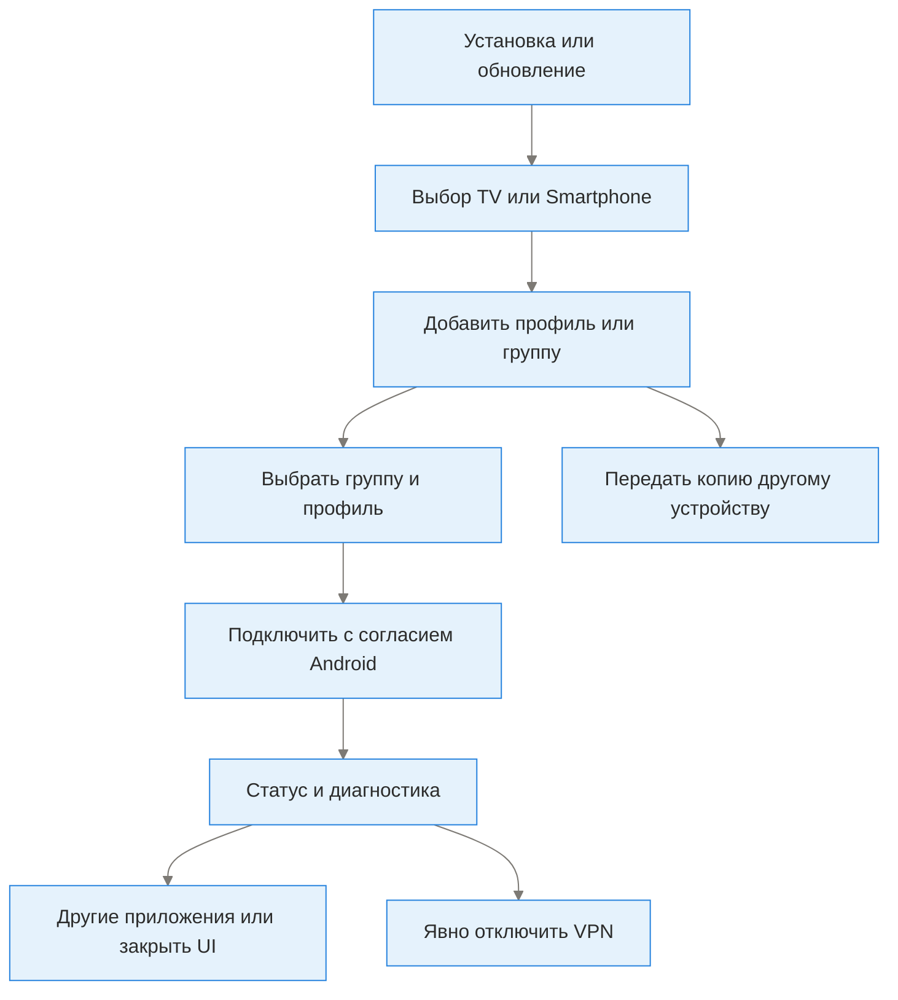

# Пользовательские сценарии и приёмка

## Карта жизненного цикла

| ID | Вход / действия | Успех | Ошибка / важное ограничение |
|---|---|---|---|
| S01 | Установить подходящий ARM32/ARM64/universal APK | Android показывает TunXBox; версия соответствует manifest | Сертификат или package отличаются — это не обновление; не удалять данные без backup |
| S02 | Обычный запуск → один tap/OK на TV или Smartphone | Загружается выбранный UI, не Share chooser; стартовый TV focus Connect | Последний выбор — подсказка фокуса, а не пропуск picker; deep links идут отдельно |
| S03 | TV на телефоне → портрет/альбом, DPAD/касания | Карточки, QR, верхний ряд и focus доступны | Проверить системный auto-rotate, OEM insets и реальные размеры; smoke не измеряет плавность |
| S04 | TV → Add profile / пустая карточка → Receive — show QR → камера телефона → браузер | Видимый browser banner; число профилей; TV acknowledgement и возврат к списку | Только одна форма ввода; тот же trusted LAN; не показывать в issue секретную ссылку |
| S05 | Получить подписку HTTP(S) через браузер/буфер/URL | Подписка сохранена группой, скачана принимающим устройством | VPN только на телефоне не даёт TV сетевой доступ; неверный контент ≠ ошибка LAN |
| S06 | Передать группу → показать LAN QR → другое устройство TunXBox Scan QR | Новая basic group со всеми профилями и remapped внутренними chains | Обновить оба устройства; внешние зависимости/циклы/лимиты — отказ всей операции, не частичный успех |
| S07 | Выбранный профиль → Send profile / profile actions → QR | На другом приложении импортируется стандартная/поддерживаемая ссылка | Camera/image scanner нужен принимающему; неподдерживаемый одиночный формат не скрывать, использовать группу/backup |
| S08 | Manual → один из 17 редакторов → Save → select → Connect | Профиль появился; consent обработан; :bg service сообщает состояние | Нужный plugin может отсутствовать; активный/выбранный профиль различаются |
| S09 | Group TCP/URL test → результаты → сортировка; active tunnel test | Понятны объект проверки и latency/result/error; отмена прекращает тест | TCP test не ICMP; результат зависит от endpoints; Connected не доказывает Интернет |
| S10 | При подключении → Home / YouTube / Close / Restart UI | UI меняется/закрывается, VPN stop не отправлен | Наличие YouTube и фоновой живости зависит от ОС; Disconnect — отдельное действие |
| S11 | Переключить профиль во время Connecting/Stopping; повторить команды | Guard не запускает конфликтующие операции; state понятен | Не обходить busy guard; ошибки сервиса не превращать в false Connected |
| S12 | Изменить группу, порядок, duplicate removal; update subscription | Изменение согласовано с DB, focus сохраняется | Новые подписочные данные могут менять профили; проверять выбранный/активный ID |
| S13 | Rules / per-app / DNS / TLS / assets / plugins | Условия совпадают с желаемым network behavior | Проверять security overrides, DNS leaks, доступность geodata; не обещать гарантию по одному UI test |
| S14 | Backup → export → проверенное restore | Профили/правила/настройки восстановлены в выбранном объёме | Файл содержит секреты; restore не равно group copy и может остановить VPN |
| S15 | About → update check → APK поверх | Пакет/подпись совпадают, versionCode вырос, данные сохранены | Rolling tag/title сам по себе не новый Android version; источник manifest обязателен |
| S16 | Ошибка → logs/About → issue | Версия, ABI, Android, шаги и безопасный фрагмент лога воспроизводимы | Удалить токены, URL подписок, IP/пароли и private signing material из публичного отчёта |

## Различать направления QR

- **Receive — show QR:** QR показывает принимающий TV. Браузер телефона отправляет payload, либо TunXBox scanner телефона POST-ит текущую группу.
- **Send group — show QR:** QR показывает отправитель; scanner принимающего TunXBox GET-ит полный snapshot.
- **Send profile — show QR:** QR содержит ссылку одного профиля; не временный сервер и не вся группа.
- **Scan QR/image:** устройство читает QR, показанный другим устройством/приложением, либо файл изображения. TV без камеры должен использовать Receive/browser или изображение.

## Уровни доказательств

JVM tests проверяют функции/обработчики; Robolectric — Android-shaped lifecycle без настоящей ОС; device instrumentation — установленный debug APK и реальный x86_64 Android; release checks — metadata/signature/ELF/bytes; physical acceptance — телефон/приставка/пульт и реальный VPN. Эти уровни дополняют друг друга.

[Точные автоматические проверки](emulator-testing.md) · [Физический чек-лист](tv-readiness-plan.md) · [Безопасность](security.md)
